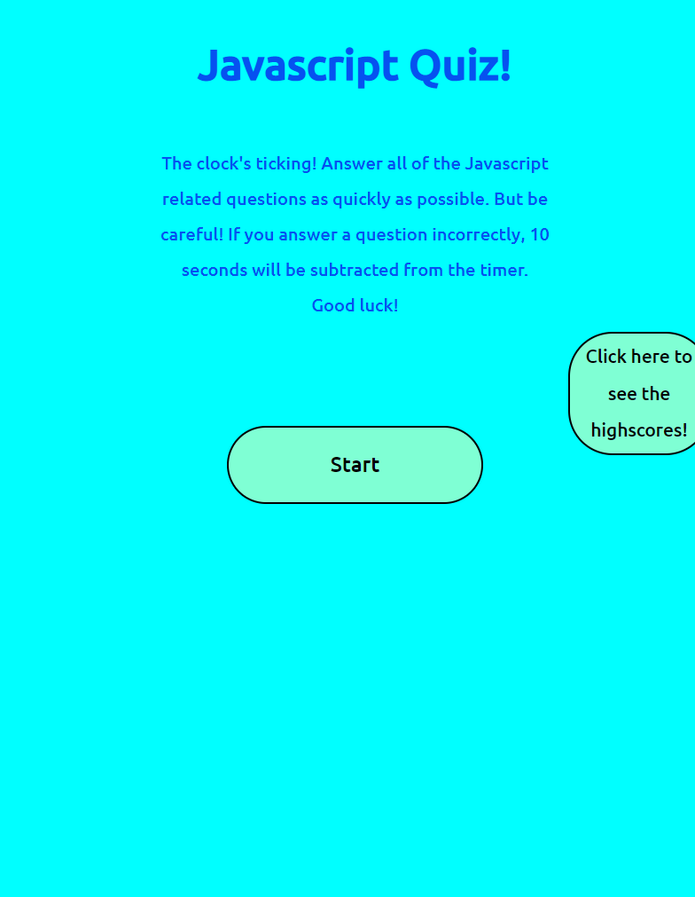

# Javascript Quiz - Test your knowledge!

## Description

This is a simple Javascript program that quizzes the user on some basic Javascript fundamentals.
Complete with a scoring system and timer, this quiz will record the user's score afterwards and allow them to place their name on the local leaderboard (the highest score will appear on top!).

## Usage

When the user loads the page they have two options: To click start, or to view the highscores page. Clicking on these buttons will trigger their respective actions. On start, a list of options for the user to choose appears. Click through all of the questions to your best ability. Once the user reaches the end, the will be prompted to enter a name/username. After submitting their score, the highscores page will be updated. On the highscores page, the user can choose to clear the existing highscores.

Screenshot of application: 

Link to application: 